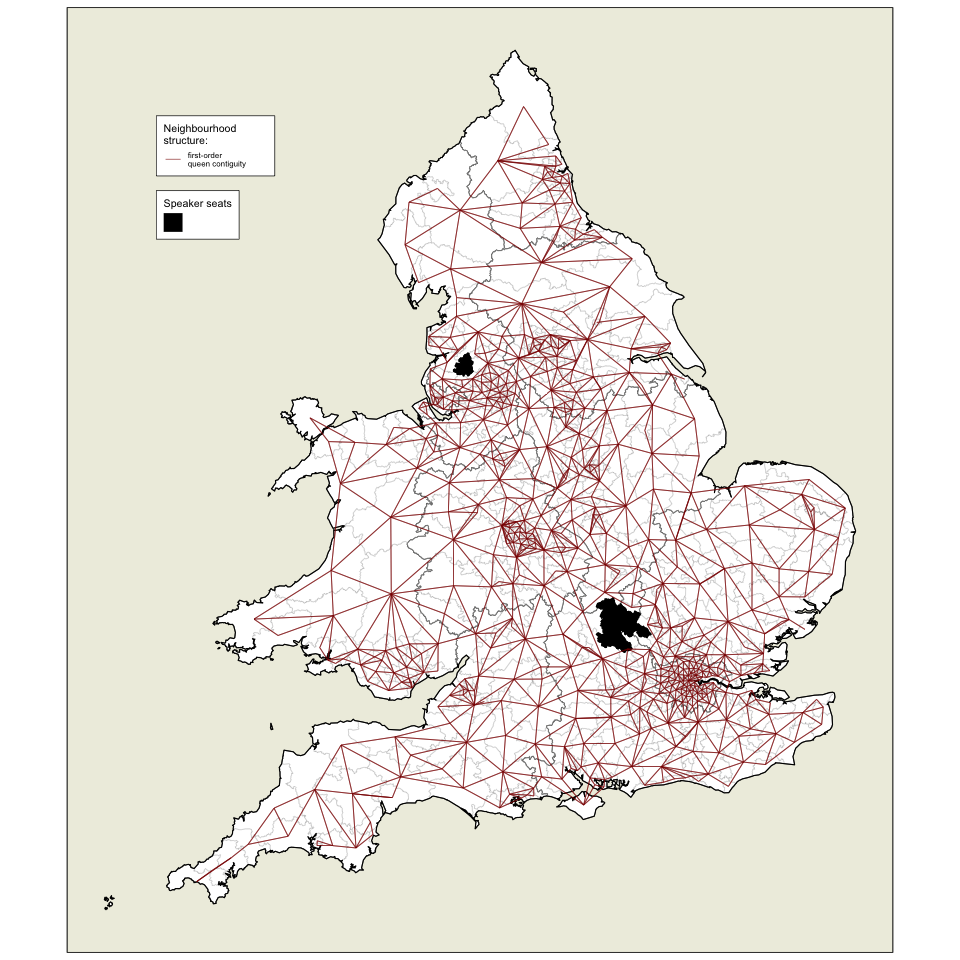
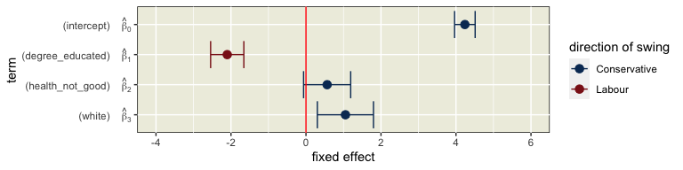
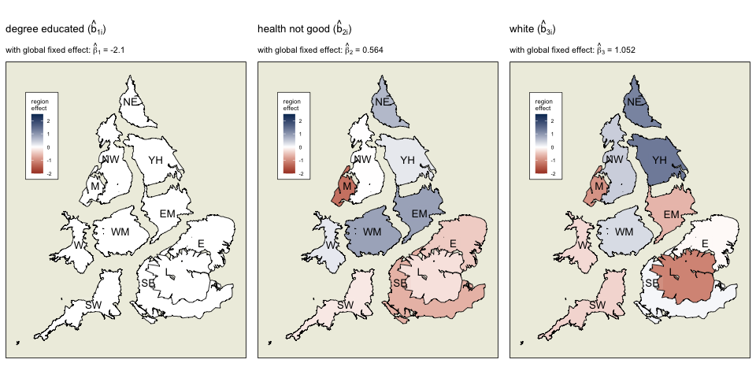
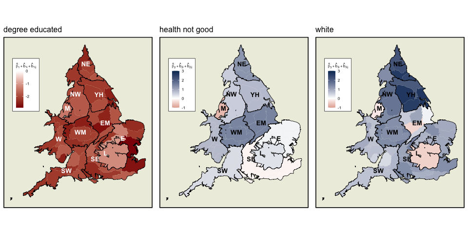

<!-- README.md is generated from README.Rmd. Please edit that file -->

# A multilevel spatial model to investigate voting behaviour in the 2019 UK general election

Kevin Horan1\*, Chris Brunsdon2 and Katarina
Domijan3

1 Hamilton Institute, Maynooth University, Maynooth,
Ireland.  
2 National Centre for Geocomputation, Maynooth University,
Ireland.  
3 Department of Mathematics and Statistics, Maynooth
University, Maynooth, Ireland.  
\* contact author: <kevin.horan.2021@mumail.ie>
<!-- badges: start -->

<!-- badges: end -->

Full paper published in [Applied Spatial Analysis and
Policy](https://link.springer.com/journal/12061) (11 January 2024) with
open access available at this
[link](The%20full%20paper%20is%20available%20here:%20%5BApplied%20Spatial%20Analysis%20and%20Policy%5D(https://doi.org/10.1007/s12061-023-09563-6).).

This repository contains the code used to produce the findings discussed
in this paper.

## Abstract

*This paper presents a modelling framework which can detect the
simultaneous presence of two different types of spatial process. The
first is the variation from a global mean resulting from a geographical
unit’s ‘vertical’ position within a nested hierarchical structure such
as the county and region where it is situated. The second is the
variation at the smaller scale of individual units due to the
‘horizontal’ influence of nearby locations. The former is captured using
a multi-level modelling structure while the latter is accounted for by
an autoregressive component at the lowest level of the hierarchy. Such a
model not only estimates spatially-varying parameters according to
geographical scale, but also the relative contribution of each process
to the overall spatial variation. As a demonstration, the study
considers the association of a selection of socio-economic attributes
with voting behaviour in the 2019 UK general election. It finds evidence
of the presence of both types of spatial effects, and describes how they
suggest different associations between census profile and voting
behaviour in different parts of England and Wales.*

## Data visualisation

### Dependent variable and guide map

Left: Values of dependent variable, Butler swing to the Conservatives,
mapped across constituencies of England and Wales. The vast majority of
constituencies recorded a positive swing. Figures projected as Dougenik
cartograms such that equal populations occupy equal area while
maintaining constituency contiguities.

Right: Guide map of the regions of England and Wales under a similar
projection.

### Swingometers

Graphical representation of swing by region and county. Swing is scaled
relative to circle such that the maximum swing is 90 degrees from the
vertical. In this regional map, the North East swing of 8.36% is the
maximum.

### Contiguities

Create contiguity matrix of constituencies, with some manual alterations
to account for islands, bridges, ferries and tunnels.

First order queen contiguity structure of constituencies in England and
Wales, shown as edges radiating from nodes at the centroid of
constituencies.

### Explanatory variables

| Explanatory variable | Calculation from census                                                         | Justification/theory                                |
|-----------------|----------------------------------|----------------------|
| degree educated      | percentage of population with level 4 qualification or higher                   | post-industrial / knowledge-economy / peripherality |
| health not good      | percentage of the population self-reporting ‘poor’, ‘bad’, or ‘very bad’ health | life outcomes / young people                        |
| white                | percentage of population of white ethnicity                                     | ethnic / cultural diversity / values                |

Description of explanatory variables

Values of independent variables mapped across England and Wales. Figures
projected as Dougenik cartograms such that equal populations occupy
equal area while maintaining constituency contiguities.

## Modelling

### Simplest model

Map of residuals from a simple linear model which does not take
geography into account. Regions such as the South West and Merseyside
appear to be almost completely red (overprediction of swing), the North
East show a block of red alongside a block of blue, while a blue pattern
of underprediction spreads across the boundary between the East Midlands
and Yorkshire and the Humber.

### Model variations

#### Alternative autoregressive components

This framework, however, also allows for more complex structures than
this. For example, in addition to the random intercepts and slopes
provided for in the hierarchical component, we have the option of using
either

1.  spatially autocorrelated random slopes for each covariate in each
    constituency,
2.  a spatially autocorrelated random intercept at constituency level,
    or
3.  both together.

To decide which of these three options was most suitable for this
particular dataset, their performances can be compared. The fitting of
such spatial models using the `mgcv` package requires the tuning of a
parameter *k* which is the number of basis functions used to generate
the autoregressive smoothing. Lower values of *k* lead to a smoother
result. This is because *k* represents the number of components from the
eigen decomposition of the variance-covariance structure which are to be
used. Not all can be used because there are not enough data points for
this to be computable. The *k* value has been optimised for each model
such that the Akaike information criterion (AIC) is minimised, striking
a balance between goodness of fit and model complexity.

### Model comparison

Shown below are performance metrics for each of these model
combinations, named models **1-3**. Of these three potential structures,
model **2**, which we have been discussing, has the best performance
metrics and was deemed the most suitable structure for modelling this
particular dataset. Such a process can be used to find the most suitable
structure for any potential dataset.

| Model | Autoregressive spatial process(es)            | AIC  | RMSE | adjR2 | Loglik |
|---------|----------------------------|---------|---------|---------|---------|
| 1     | constituency component                        | 2336 | 1.43 | 0.76  | -1015  |
| 2     | varying coefficients                          | 2373 | 1.62 | 0.73  | -1086  |
| 3     | constituency component + varying coefficients | 2381 | 1.64 | 0.73  | -1094  |

### Optimal model

The structure of the model is outlined below:

$$
\begin{aligned}
y\_{ijk} &=  \beta_0 + \beta_1 degree\_{ijk} + \beta_2 health\_{ijk} + \beta_3white\_{ijk}\\
&+ b\_{0i} + b\_{1i} degree\_{ijk} + b\_{2i} health\_{ijk} + b\_{3i}white\_{ijk}\\
&+ b\_{0ij} + b\_{1ij} degree\_{ijk} + b\_{2ij} health\_{ijk} + b\_{3ij}white\_{ijk}\\
&+ \gamma\_{l}\|\gamma\_{m}, l\neq{m}\\
&+ \epsilon\_{ijk}
\end{aligned}
$$

where *y**i**j**k* is the swing in constituency *k* in county
*j* in region *i* for

-   *i* = 1, ..., 11 regions,

-   *j* = 1, ..., *J**i* counties within region *i*,

-   *k* = 1, ..., *K**i**j* constituencies within county *j*
    within region *i*, and

-   *l* = 1, ..., 571 individual constituencies.

-   *β*0, *β*1, *β*2, *β*3
    are fixed effects.

-   *b*0*i*, *b*1*i*, *b*2*i*,
    *b*3*i* are the random effects (intercept and three
    slopes) associated with region *i*,

-   *b*0*i**j*, *b*1*i**j*, *b*2*i**j*,
    *b*3*i**j* are the random effects (intercept and three
    slopes) associated with county *j* in region *i*.

-   *ϵ**i**j**k* are independent normally distributed error
    terms.

Rather than estimate each of the random effect coefficients directly,
the variance of each random effect is instead estimated. For the region
and county level random effects, each is assumed to be independent of
the others within its level, and to be normally distributed with mean of
zero. This independence is a key restriction in multi-level modelling
with `mgcv` as opposed to other packages.

The *γ**l*’s are constituency level random effects which
model the spatial interactions at the lowest level of the model, based
on an ICAR distribution. Let there be *m* = 1, ..., *M* potential
neighbouring constituencies, where *M* = *L* = 571. Each
*γ**l* is conditional on the sum of the weighted values of
its neighbouring *γ**m*’s
(w*l**m**γ**m*) and has unknown variance. As a
constituency is not a neighbour to itself, the full conditional
distribution can be written as follows:
$$\gamma_l \| \gamma_m,l\neq{m} \sim\text{N}\bigg(\frac{\sum\_{l\neq{m}}{\gamma_l}}{d_l},\frac{\sigma\_{l}^2}{d_l}\bigg)$$
where the term *d**l* represents the number of neighbours.
Thus the mean of each *γ**l* is equal to the average of its
neighbours, while its variance decreases as the number of neighbours
increases.

The joint specification of the ICAR random vector *γ* when centred at 0
with common variance 1 rewrites to the pairwise difference formulation:
$$\gamma \propto\text{exp}\bigg(-\frac{1}{2}\Sigma\_{l\neq{m}}(\gamma_l-\gamma_m)^2\bigg)$$
To overcome the problem of unidentifiability, the constraint
*Σ**L**γ**l* = 0 is added to centre the model.

## Results

The aim of this modelling structure was to enable us

1.  to test for the presence of spatial effects resulting in different
    associations between covariates and the dependent variable according
    to geography, taking into account both hierarchical and
    autoregressive spatial processes (*spatial heterogeneity*),

2.  and also to estimate the relative variance associated with each type
    of process at different spatial scales (‘*analysis of variance*’ of
    spatial processes). Plot of fixed or global intercept and
    coefficients from combined model, coloured according to direction of
    association with swing. A higher proportion of people of white
    ethnicity in an average constituency is associated with a swing to
    the Conservatives while the opposite is true for increases in the
    proportion of degree-educated.

### Fixed effects

### Region randoms

Regions of England and Wales, coloured according to direction and
magnitude of region-level random effects of each covariate with swing to
the Conservatives. The global fixed effect from which these divergences
occur is shown above each map. Unlike ‘health not good’ and ‘white’,
‘degree educated’ does not show significant divergence at this level
from its global coefficient.

### County randoms

Random effects of ‘degree educated’ variable at the county level of
England and Wales. Particularly strong within-county variation can be
observed in the East.

Random effects of ‘white’ variable at the county level of England and
Wales. Particularly strong within-county variation can be observed in
the East Midlands.

### Table of variances

### Net hierarchical effects

Net hierarchical effects of each variable. These are the sum, for each
coefficient, of its fixed effect and two random effects (at region and
county level), showing the spatial heterogeneity accounted for by the
hierarchical component of the model. ‘Degree educated’ is negatively
associated with swing to the Conservatives across England and Wales,
albeit to different extents. ‘Health not good’ and ‘white’ show not only
different magnitudes but also different directions of association with
swing in different regions and counties across the study area.

### Constituency level

The spatially autoregressive (in this case, ICAR) component at the
lowest level (constituency) of the model. It shows a blue area of
increased tendency to swing to the Conservative party, surrounded by a
paler band, and red areas to the south, west and parts of the north
where the tendency is to swing to Labour, controlling for the covariates
and hierarchical effects. Areas of clear cross-regional spillover of
effects are highlighted with red circles.

### Spatial diagnostics of model

Left: Residuals from model, mapped by location, which appear by visual
inspection to be randomly distributed.

Right: dot-plot of residuals of constituencies against their spatially
lagged neighbours which shows neither a positive nor negative
association between a constituency’s residuals and those of its
neighbours.

